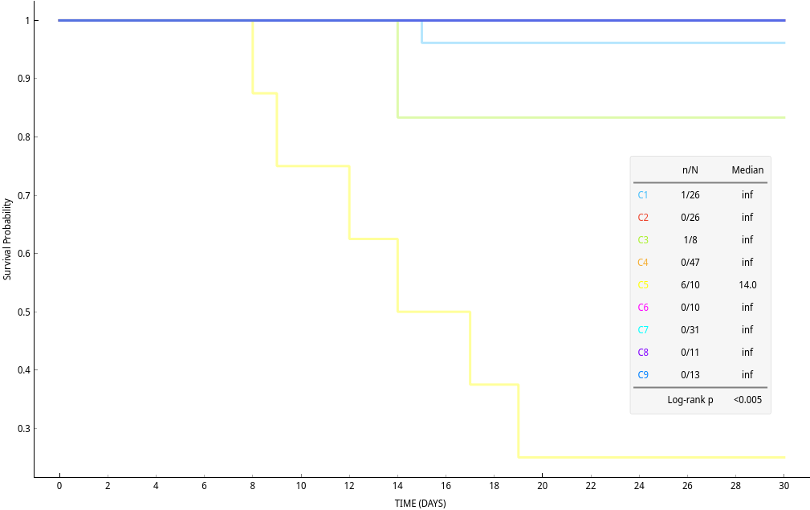
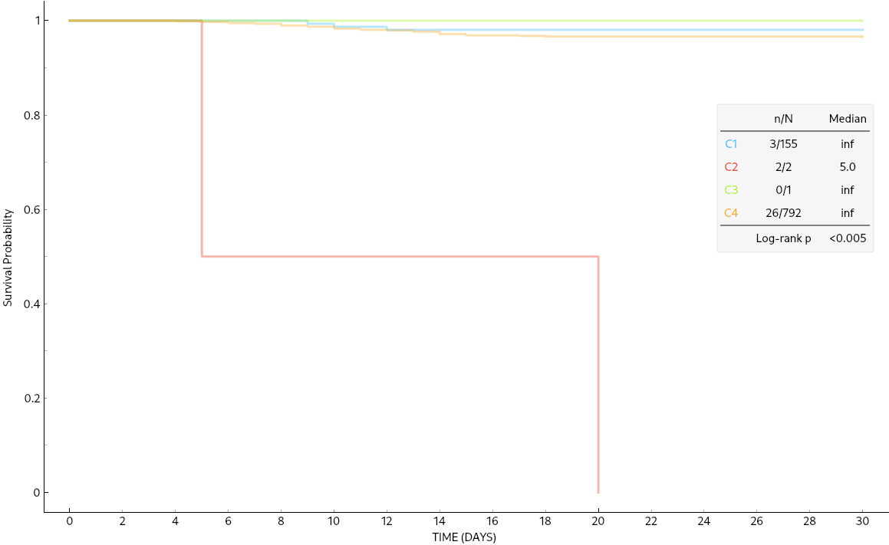
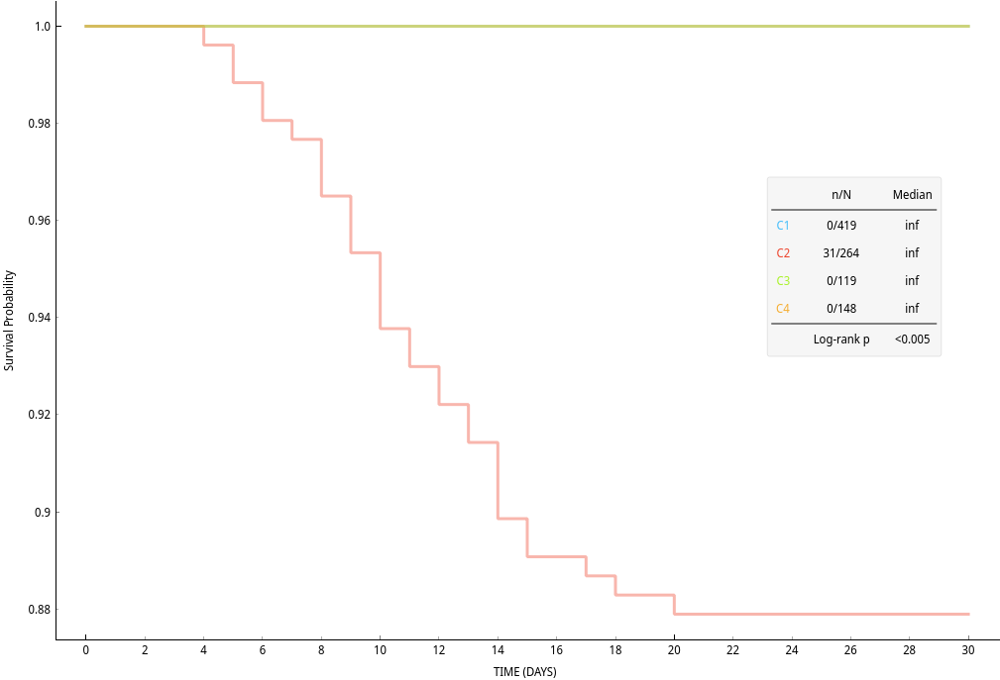

# Projeto Predizendo Prognóstico de Mortalidade por COVID-19 com Dados Sintéticos
# Project Predicting COVID-19 Mortality Prognosis with Syntetic Data

# Apresentação

O presente projeto foi originado no contexto das atividades da disciplina de pós-graduação [*Ciência e Visualização de Dados em Saúde*](https://ds4h.org), oferecida no primeiro semestre de 2022, na Unicamp.

| Nome                       | RA     | Especialização |
| -------------------------- | ------ | -------------- |
| Cristiano Sampaio Pinheiro | 256352 | Computação     |
| Jhonatan Cléto             | 256444 | Computação     |
| Mylena Roberta dos Santos  | 222687 | Computação     |

# Contextualização da Proposta

A proposta de predição adotada foi a seguinte:

> Dado um paciente com COVID-19, qual é a probabilidade dele morrer, em decorrência dessa doença, em até 30 dias após a data do diagnóstico?

A escolha específica pela doença causada pelo novo coronavírus (SARS-CoV-2) foi motivada pela pandemia em curso enfrentada por todo o mundo. O contexto que estamos vivenciando desde a disseminação do vírus deu destaque a essa enfermidade, incentivando a realização e a ampla divulgação de pesquisas acadêmicas relacionadas a ela.

Por conseguinte, informações sobre diversos aspectos da COVID-19 - por exemplo, o que fazer em caso de exposição, sintomas associados e grupos de risco -, podem ser encontradas com relativa facilidade em fontes confiáveis, como sites de organizações competentes, canais de comunicação de autoridades da área de saúde e jornais.

A Organização Mundial da Saúde (OMS), ou World Health Organization (WHO), definiu em seu Q&A (Questions and Answers) [1], atualizado pela última vez em 13 de março de 2021, que o tempo desde a exposição ao vírus até a manifestação dos sintomas é, em média, de 5-6 dias, podendo variar de 1-14 dias. Ademais, a OMS aconselha que pessoas expostas ao SARS-CoV-2 fiquem isoladas por 14 dias a fim de evitar a propagação do vírus.

Desse modo, considerando o tempo máximo dentre a exposição ao vírus e a manifestação dos sintomas e também o tempo indicado de isolamento em caso de exposição, optamos por analisar a morte de pacientes pela COVID-19 em até 30 dias (um mês) após a data do diagnóstico.

## Ferramentas

* `Python` [2] - linguagem utilizada para desenvolver os códigos para exploração dos dados, preparação dos dados e análise dos resultados dos modelos de predição desenvolvidos. 
    * `pandas` [3] - biblioteca do Python usada para manipular e analisar as bases de dados e os resultados dos modelos.
* `Google Colab` - empregado para desenvolver e executar os códigos Python em notebooks.
* `Google Drive` - utilizado para armazenar os notebooks do Colab e os arquivos CSV com as bases de dados e os resultados.
* `Orange` [4] - kit de ferramentas empregado no desenvolvimento e análise dos resultados dos modelos de predição.

# Metodologia

Ao definirmos a proposta de predição, partimos para o estudo dos conjuntos de dados disponibilizados para a execução do projeto. Tais conjuntos são resultantes do Synthea (Synthetic Patient Population Simulator) [5], um gerador de pacientes sintéticos que modela o histórico médico desses pacientes. O projeto desse gerador tem como objetivo produzir dados sintéticos, realistas (mas não reais), de pacientes e registros de saúde associados em vários formatos. Sendo que os dados gerados por ele são livres de custo, privacidade e restrições de segurança.

Ao todo foram disponibilizados quatro cenários (`scenario01`, `scenario02`, `scenario03` e `scenario04`) de históricos médicos de pacientes sintéticos. Todavia, optamos por trabalhar com somente três deles ([`scenario01`](data/raw/scenario01.zip), [`scenario02`](data/raw/scenario02.zip) e [`scenario03`](data/raw/scenario03.zip)), pois o cenário restante conta com um volume de dados incompatível com poder de processamento das ferramentas com as quais escolhemos trabalhar (vide a Tabela 1).

| Cenário | Número de Pacientes | Intervalo Temporal dos Históricos Médicos | Estado de Residência dos Pacientes | Cidade de Residência dos Pacientes |
| ---------- | -----  | ------- | ------------- | -------- |
| scenario01 | 1174   | 10 anos | Massachusetts | Diversas |
| scenario02 | 1121   | 10 anos | Alaska        | Juneau   |
| scenario03 | 11573  | 10 anos | Washington    | Diversas |
| scenario04 | 117531 | 10 anos | Massachusetts | Diversas |

*Tabela 1 - Informações sobre os cenários gerados pelo Synthea que foram disponibilizados.*

Antes de definirmos quais dados dos cenários adotados seriam empregados no projeto, determinamos como seriam desenvolvidos os modelos de predição. Sendo que optamos pelo uso de técnicas de aprendizagem de máquina não supervisionada para tal, em específico, escolhemos a Clusterização Hierárquica e também a Clusterização K-means. 

Nosso objetivo ao eleger essa abordagem é analisar os *clusters* gerados, identificando os grupos que contêm os pacientes com os conjuntos de características que aumentam a mortalidade por COVID-19 e quantificando as mortalidades associadas a esses grupos no período definido na proposta. Ou seja, temos como propósito levantar as características de um paciente que tendem, estatisticamente, a levá-lo a óbito pela doença em questão, auxiliando na definição do prognóstico de mortalidade do indivíduo.

Decidimos adotar as duas técnicas de clusterização citadas a fim de comparar os resultados produzidos por cada abordagem, verificando as diferenças e semelhanças entre os *clusters* gerados por elas. Ademais, em decorrência da comparação, desejamos definir se uma das técnicas é mais adequada para a proposta ou se ambas produzem resultados com a mesma qualidade.

Voltando aos cenários de históricos médicos, segue que cada um conta com os dados fragmentados em 18 tabelas no formato de arquivos CSV, sendo que todas estão descritas no dicionário de dados dos arquivos CSV do Synthea [6]. De acordo com a nossa proposta e com os objetivos que levantamos para o projeto, decidimos adotar as bases descritas na Tabela 2.

| Arquivo             | Descrição                                              |
| ------------------- | ------------------------------------------------------ |
| `conditions.csv`    | Condições ou diagnósticos do paciente                  |
| `encounters.csv`    | Dados de encontro do paciente                          |
| `immunizations.csv` | Dados de imunização do paciente                        |
| `patients.csv`      | Dados demográficos do paciente                         |
| `procedures.csv`    | Dados de procedimento do paciente, incluindo cirurgias |

*Tabela 2 - Descrições dos arquivos CSV das tabelas adotadas como base para o estudo.*

Com as bases de estudo definidas, avançamos para a preparação de dados que pode ser encontrada no notebook [`data_processing_COVID_19_patients.ipynb`](notebooks/data_processing_COVID_19_patients.ipynb). De início, partindo das tabelas de `conditions`, selecionamos os `IDs` dos pacientes que foram diagnosticados com COVID-19, chegando a 86, 96 e 950 indivíduos com essa condição em, respectivamente, `scenario01`, `scenario02` e `scenario03`. Tomando esses identificadores, filtramos os dados das demais tabelas, reduzindo o escopo da análise somente aos pacientes que tiveram COVID-19.

Considerando a proposta adotada para o projeto, decidimos que algumas das variáveis contidas nas tabelas apresentavam baixa relevância no contexto da abordagem adotada para o desenvolvimento dos modelos de predição. Portanto, após removermos as colunas correspondentes a essas variáveis, segue que, para cada cenário:

* as tabelas `conditions`, `immunizations` e `procedures` têm somente duas colunas, `PATIENT` e `DESCRIPTION`;
* a tabela de `encounters` tem as colunas: `START`, `PATIENT` e `DESCRIPTION`;
* e a tabela de `patients` tem as colunas: `Id`, `BIRTHDATE`, `DEATHDATE`, `RACE`, `ETHNICITY`, `GENDER`, `CITY` e `STATE`.

Ademais, julgamos que seria útil adicionar alguns dados na tabela `patients` para serem utilizados pelos modelos de predição. Assim, geramos as seguintes colunas:

* `AGE` - idade do paciente.
* `COVID DIAGNOSIS DATE` - data do diagnóstico de COVID-19.
* `DIED IN ONE MONTH` - booleano que identifica se o paciente morreu (1) ou não (0) por COVID-19 em até 30 dias após o diagnóstico da doença.
* `LAST ENCOUNTERS OR DIED DATE` - data da morte por COVID-19 ou data do último encontro com o paciente em até 30 dias após o diagnóstico da doença.
* `TIME (DAYS)` - diferença entre `LAST ENCOUNTERS OR DIED DATE` e `COVID DIAGNOSIS DATE`.

Sendo que as colunas `LAST ENCOUNTERS OR DIED DATE` e `TIME (DAYS)` foram concebidas visando a aplicação de uma análise de sobrevivência sobre os resultados dos modelos. Em específico, os dados de `TIME (DAYS)` foram pensados para ser usados como tempo de sobrevivência ou censura.

Após a remoção das variáveis menos relevantes e a adição de dados que seriam utilizados pelos modelos de predição, visando a maneira como os dados são consumidos pelo Orange, concatenamos, para cada cenário, os dados de todos pacientes diagnosticados com COVID-19  em uma tabela. De modo que a concatenação citada resultou do *merge* entre as tabelas `patients`, `conditions`, `immunizations` e `procedures`.

Isto é, ao final da preparação de dados, geramos as tabelas: links das tabelas resultantes. Cada linha das tabelas corresponde a um determinado paciente e cada coluna corresponde a uma variável relacionada ao paciente em questão, podendo representar dados textuais, numéricos ou booleanos. Especificamente sobre as colunas com dados booleanos, elas correspondem a uma descrição (`DESCRIPTION`) de `conditions`, `immunizations` ou `procedures` e apresentam 1 se o paciente tem a condição tratada, foi imunizado pela vacina específica ou passou pelo procedimento em questão.

## Bases Adotadas para o Estudo
* scenario01
* scenario02
* scenario03

# Resultados Obtidos

### Modelo

Considerando que no `scenario01` e no `scenario02` existem poucos pacientes diagnosticados com COVID-19 (86 e 92, respectivamente), optamos por concatená-los para obtermos um grupo mais significativo de indivíduos na amostra. Assim, nas análises apresentadas posteriormente faremos comparações entre as duas técnicas de clusterização dentro do `scenario01+02` e dentro do `scenario03`, além de comparações entre os resultados das clusterizações dos dois cenários.

Devido a nossa abordagem de preparação de dados, ambos os cenários possuem um número diferente de *features*, são 295 no `scenario01+02` e 441 no `scenario03`. Decidimos manter essa diferença quantitativa de *features* para identificar se as diferentes dimensionalidades teriam algum efeito considerável nos resultados das técnicas de clusterização entre os dois cenários.

Tomando como base a preparação dos dados para clusterização proposta por Y. Komaru, T. Yoshida, et al. no artigo "Hierarchical Clustering Analysis for Predicting 1-Year Mortality After Starting Hemodialysis" [7], analisamos as correlações existentes entre as *features* presentes em cada cenário. O objetivo dessa análise era encontrar *features* fortemente correlacionadas, de modo a remover as que não agregassem valor significativo para a clusterização. Para tanto, definimos que, para o par que apresentasse uma correlação maior ou igual a 0.6, uma delas deixaria de ser considerada para a clusterização. Como resultados, obtivemos que apenas `AGE` e `BIRTHDATE` apresentaram correlação acima de 0.6, o que decorre do fato de que  `AGE` foi gerada a partir de `BIRTHDATE`. Portanto, optamos por não considerar `BIRTHDATE`como uma *feature*.

Um dos grandes desafios em adotar técnicas de clusterização é definir o número de *clusters* que serão utilizados no modelo. No caso do método K-means, o `Orange` apresenta um recurso, denominado como método Pontuação da Silhueta (*Silhouette Score*) [8], que nos permite definir e avaliar um conjunto de possíveis valores para o número de *clusters* (`K`). Nesse método, para cada candidato ao valor ideal de `K`, é calculada uma pontuação que está relacionada à similaridade que um elemento apresenta em relação ao seu *cluster* quando comparado aos demais *clusters*. Assim, a melhor escolha para o número de clusters `K` é o valor que apresenta a maior pontuação dentro do conjunto avaliado. 

Decidimos avaliar o intervalo de valores entre 2 e 10 inclusive para os candidatos a `K` em ambos os cenários considerados, conforme mostra a Figura 1. No `scenario01+02`, a ferramenta indicou que `K = 9` seria a melhor configuração, e, no `scenario03`, `K = 4` foi a configuração recomendada. Assim, assumimos esses valores para o número de *clusters* tanto no método K-means quanto no método hierárquico em seus respectivos cenários.

**Figura 1**: Pontuação de Silhueta para os valores no intervalo de 2 a 10 inclusive, resultados para o `scenario01+02` a esquerda e `scenario03` a direita.

Objetivando aplicar nossos modelos de clusterização no prognóstico de mortalidade de pacientes com COVID-19, realizamos análises de sobrevivência nos *clusters* encontrados pelas técnicas de aprendizagem não supervisionada. Sendo que esse tipo de análise tem por objetivo o estudo temporal da taxa de sobrevivência de um grupo a um determinado evento. Assim, definimos nosso evento como a morte de um paciente devido a COVID-19 e o período de análise como 30 dias após o diagnóstico positivo para a doença. Agrupamos os indivíduos em seus respectivos *clusters* e consideramos a probabilidade de sobrevivência em cada *cluster* como 1 no momento do diagnóstico. 

Definidos os parâmetros iniciais, utilizamos o método de estimativa de Kaplan-Meier [9] para plotar, no período estudado, a função probabilidade de sobrevivência de cada *cluster*. Nesse método, a probabilidade de sobrevivência de um grupo diminui à medida que seus integrantes experimentam o evento. Em nossas análises, isso acontecia através da observação das *features* `TIME (DAYS)` e `DIED IN ON MONTH`. A probabilidade de sobrevivência de um *cluster* diminui à medida que `DIED IN ONE MONTH` se tornar 1 no dia indicado por `TIME (DAYS)` para algum paciente pertencente àquele *cluster*.

Após todas as configurações, constatações e ajustes citados que foram aplicados a nossa metodologia, chegamos aos *workflows* vistos nas Figuras 2 e 3.

**Figura 2:** Workflow dos modelos de clusterização no `scenario01+02`.

**Figura 3:** Workflow dos modelos de clusterização no `scenario03`.

### [Scenario01+02](data/processed/concatenated_data_scenario01.csv)

No `scenario01+02`, obtemos na Clusterização Hierárquica os *clusters* apresentados na Tabela 3.
 
| Cluster | Número de Pacientes |
| -- | -- |
| C1 | 1 |
| C2 | 31 |
| C3 | 2 |
| C4 | 2 |
| C5 | 1 |
| C6 | 42 |
| C7 | 101 |
| C8 | 1 |
| C9 | 1 |

**Tabela 3:** Distribuição dos pacientes na Clusterização Hierárquica para o `scenario01+02`.

Sendo que apenas em C3, C4 e C7 existem pacientes que morreram de COVID-19 dentro do intervalo do primeiro mês após o diagnóstico.

Da análise de sobrevivência para essa clusterização, vide a Figura 4, observamos que a probabilidade de sobrevivência para o *cluster* C3 se torna zero a partir do 17º dia. Para C4, a probabilidade de sobrevivência se torna zero em 14 dias. Desse modo, verificamos que todos os indivíduos desses grupos morrem em menos de um mês. Para C7, notamos que a probabilidade de sobrevivência ao fim dos 30 dias se mantém acima de 0.97, ou seja, a taxa de sobrevivência desse grupo é alta. Para os demais *clusters*, uma vez que eles não contêm pacientes falecidos, a probabilidade de sobrevivência permanece 1.

**Figura 4:** Curvas Kaplan-Meier dos clusters obtidos na Clusterização Hierárquica do `scenario01+02`.

Na Clusterização K-means para o `scenario01+02`, os *clusters* resultantes podem ser visualizados na Tabela 4.

| Cluster | Número de Pacientes |
| -- | --|
| C1 | 26 |
| C2 | 26 |
| C3 | 8 |
| C4 | 47 |
| C5 | 10 |
| C6 | 10 |
| C7 | 31 |
| C8 | 11 |
| C9 | 13 |

**Tabela 4:** Distribuição dos pacientes na Clusterização K-means para o `scenario01+02`.

De modo que C1, C3 e C5 são os que apresentaram pacientes que morreram por COVID-19 em até 30 dias.

A Figura 5 apresenta o gráfico das funções probabilidade de sobrevivência para cada *cluster* da Clusterização K-means no `scenario01+02`. A partir dela, notamos que a probabilidade de sobrevivência em C1 se mantém acima de 0.96 e em C3 acima de 0.8 após os 30 dias. Em C5, a partir do 19º dia, a probabilidade de sobrevivência cai para 0.25 e se mantém assim até o final dos 30 dias. Nos demais *clusters*, a taxa de sobrevivência permanece constante.

**Figura 5:** Curvas Kaplan-Meier dos clusters obtidos na Clusterização K-means do `scenario01+02`.

### [Scenario03](data/processed/concatenated_data_scenario03.csv)

No `scenario03`, a Clusterização Hierárquica gerou os *clusters* apresentados na Tabela 5.

| Cluster | Número de Pacientes |
| -- | -- |
| C1 | 155 |
| C2 | 2 |
| C3 | 1 |
| C4 | 792 |

**Tabela 5:** Distribuição dos pacientes na Clusterização Hierárquica para o `scenario03`.

Os agrupamentos C1, C2 e C4 apresentaram 3, 2 e 27, respectivamente, mortes por COVID-19.

Na Figura 6, temos os resultados da análise de sobrevivência dos *clusters* da Clusterização Hierárquica no `scenario03`. Observamos nela que a probabilidade de sobrevivência de C2 se torna zero a partir do 20º dia e que as probabilidades de sobrevivência de C1 e C4 permanecem acima de 0.96 até o fim dos 30 dias analisados. Em C3, não notamos redução na probabilidade de sobrevivência inicial.

**Figura 6:** Curvas Kaplan-Meier dos clusters obtidos na Clusterização Hierárquica do `scenario03`.

Por fim, na Clusterização K-means do `scenario03`, os *clusters* resultantes são apresentados na Tabela 6. 

| Cluster | Número de Pacientes |
| -- | -- |
| C1 | 419 |
| C2 | 264 |
| C3 | 119 |
| C4 | 148 |

**Tabela 6:** Distribuição dos pacientes na Clusterização K-means para o `scenario03`.

Nessa configuração, apenas o C2 apresentou pacientes que morreram no período analisado, sendo 32 no total. 

A Figura 7 apresenta os resultados obtidos das análises de sobrevivência nos *clusters* da Clusterização K-means no `scenario03`. Nela vemos que a taxa de sobrevivência em C1, C3 e C4 permaneceu igual a 1 em todo o período. No caso de C2, no entanto, a probabilidade de sobrevivência caiu para 0.88 no 20º dia.

**Figura 7:** Curvas Kaplan-Meier dos clusters obtidos na Clusterização K-means do `scenario03`.

### Comparações entre os resultados

Dos resultados obtidos em todas as configurações e cenários testados, concluímos que existem configurações de *clusters* que agrupam pacientes que apresentam características que os tornam extremamente vulneráveis ao óbito por COVID-19, dado que em alguns dos *clusters* observados a taxa de mortalidade é alta. Notamos a presença desses *clusters* principalmente nos resultados do método hierárquico em ambos os cenários. O método K-means gerou os *clusters* com a melhor distribuição de pacientes, no entanto, os agrupamentos se mostraram mais generalistas durante a análise de sobrevivência, uma vez que, na maioria dos *clusters* observados, o número de mortes foi amortecido pela maior quantidade de indivíduos nos grupos.

Notamos que, em relação a predição de mortalidade no intervalo de 30 dias, o `scenario01+02` se mostrou mais pessimista, especialmente na Clusterização Hierárquica, em que os *clusters* mais vulneráveis a COVID-19 apresentam probabilidade de sobrevivência nula ao final dos 30 dias. No `scenario03`, também observamos um *cluster* bastante vulnerável à doença na Clusterização Hierárquica. Todavia, no método K-means os *clusters* apresentaram uma maior probabilidade de sobrevivência ao final dos 30 dias se comparado ao `scenario01+02`.

# Evolução do Projeto

Antes mesmo de propriamente começarmos o projeto, enfrentamos uma grande dificuldade em definir a pergunta de pesquisa a ser explorada. Parte dessa indefinição decorreu da vastidão dos dados fornecidos, o que possibilitava uma infinidade de temas e abordagens a serem adotadas, no entanto, o fator que mais contribuiu para essa dificuldade foi a impressão de “limitação” em quantidade dos dados dos históricos médicos.

De início, estávamos muito presos aos dados em questões quantitativas, de modo que, sempre que levantávamos uma pergunta de pesquisa, acreditávamos que os dados fornecidos, nos dois primeiros cenários, não eram suficientes para explorar a proposta. Assim, após discutirmos algumas perguntas e continuarmos sentindo a mesma sensação de insuficiência de dados, solicitamos ajuda ao Prof. André Santanchè. Após a conversa com o professor, melhor orientados, conseguimos desapegar dos aspectos quantitativos dos dados e retornar a uma pergunta de pesquisa que já havíamos discutido, abordando o tema da COVID-19.

Com o assunto definido, após debatermos sobre o período de tempo que seria adotado para realizar a predição, chegamos ao intervalo de um mês e adotamos a seguinte pergunta: 

> Dado um paciente com COVID-19, qual é a probabilidade dele morrer, em decorrência dessa doença, em até 30 dias após a data do diagnóstico?

Com uma proposta de predição bem definida, esperávamos que a etapa de preparação de dados desse projeto fosse mínima. Uma vez que acreditávamos que o Orange trabalhasse bem com os dados no formato que foram fornecidos, em tabelas fragmentadas e com as *features* em uma só coluna, no entanto, rapidamente percebemos as limitações do *software*. Com isso, optamos por desenvolver a preparação dos dados usando `Python` juntamente com a biblioteca `Pandas`, Essa etapa foi realizada de maneira iterativa, de modo a sempre aprimorar o formato dos dados usados conforme avançávamos no desenvolvimento dos modelos. 

Inicialmente geramos uma grande tabela para cada cenário, apresentado as colunas de *features* com valores booleanos. Explorando um pouco mais os dados no Orange, decidimos acrescentar uma variável com a idade dos pacientes e uma coluna booleana informando se o paciente diagnosticado com COVID-19 veio a óbito em até um mês. Conforme nos aprofundamos nos modelos de aprendizado não supervisionado, decidimos utilizar uma análise de sobrevivência para a validação dos resultados obtidos. Então, foi necessário acrescentar aos dados a data em que o diagnóstico de COVID-19 foi realizado, uma data limite - levando em conta a data de morte pela doença ou a data da última consulta do paciente - e uma coluna com a diferença entre as datas citadas em dias (limitando a um valor máximo de 30 dias). Com isso, formatamos os dados de modo que o *workflow* no `Orange` fosse simplificado e apresentasse resultados consistentes.

Uma alteração realizada no decorrer do projeto foi o abandono do uso da tabela de `medications`. De início, adotamos os dados de medicamentos como uma *feature*, no entanto, como nenhum integrante do grupo possui conhecimentos médicos, a análise desses dados se mostrou altamente complexa. Outro fator decisivo para abandonarmos esses dados é o fato de ainda não existir nenhum medicamento com eficácia comprovada para o combate ao novo coronavírus. 

Outra alteração importante ao longo do projeto foi a decisão pelo uso limitado da tabela `encounters`. Considerando o tempo disponível para o projeto, pensamos em utilizá-la somente para verificar o número de consultas realizadas por cada paciente, no entanto, chegamos a um consenso de que essa informação não seria de grande valia. Ao fim, fizemos uso dessa tabela somente para recuperar os pacientes que possuíam COVID-19 como causa de morte na declaração de óbito.

# Discussão
> Fazer um breve debate sobre os resultados alcançados. Aqui pode ser feita a análise dos possíveis motivos que certos resultados foram alcançados. Por exemplo:
> * por que seu modelo alcançou (ou não) um bom resultado?
> * por que o modelo de um cenário não se desempenhou bem em outro?
>
> A discussão dos resultados também pode ser feita opcionalmente na seção de Resultados, na medida em que os resultados são apresentados. Aspectos importantes a serem discutidos: É possível tirar conclusões dos resultados? Quais? Há indicações de direções para estudo? São necessários trabalhos mais profundos?

# Conclusão
> Destacar as principais conclusões obtidas no desenvolvimento do projeto.
>
> Destacar os principais desafios enfrentados.
>
> Principais lições aprendidas.
>
> Trabalhos Futuros:
> * o que poderia ser melhorado se houvesse mais tempo?

# Referências Bibliográficas

[[1]](https://www.who.int/emergencies/diseases/novel-coronavirus-2019/question-and-answers-hub/q-a-detail/coronavirus-disease-covid-19) World Health Organization (WHO) - COVID-19 Q&A.

[[2]](https://docs.python.org/3/) Python Documentation.

[[3]](https://pandas.pydata.org/docs/) Pandas Documentation.

[[4]](https://orangedatamining.com/docs/) Orange Data Mining Documentation.

[[5]](https://github.com/synthetichealth/synthea/wiki) Synthea Wiki.

[[6]](https://github.com/synthetichealth/synthea/wiki/CSV-File-Data-Dictionary) Synthea Wiki - CSV File Data Dictionary.

[[7]](https://doi.org/10.1016/j.ekir.2020.05.007) Komaru Y, Yoshida T, et al. Hierarchical Clustering Analysis for Predicting 1-Year Mortality After Starting Hemodialysis.

[[8]](https://en.wikipedia.org/wiki/Silhouette_(clustering)) Silhouette Score Method - Wikipedia.

[[9]](https://en.wikipedia.org/wiki/Kaplan%E2%80%93Meier_estimator) Kaplan-Meier Estimator - Wikipedia.

[[10]](https://www.hospitalpuc-campinas.com.br/covid-19/potenciais-efeitos-do-coronavirus-no-sistema-cardiovascular/) Potenciais Efeitos do Coronavírus no Sistema Cardiovascular.