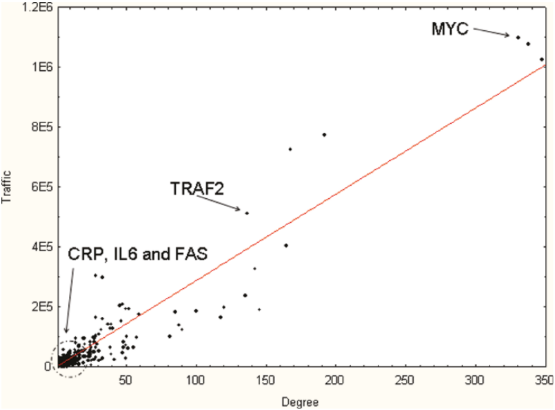

# Projeto 3 - Reproduzindo o Experimento de um Artigo Científico

# Apresentação

O presente projeto foi originado no contexto das atividades da disciplina de pós-graduação [*Ciência e Visualização de Dados em Saúde*](https://ds4h.org), oferecida no primeiro semestre de 2022, na Unicamp.

| Nome                       | RA     | Especialização |
| -------------------------- | ------ | -------------- |
| Cristiano Sampaio Pinheiro | 256352 | Computação     |
| Jhonatan Cléto             | 256444 | Computação     |
| Mylena Roberta dos Santos  | 222687 | Computação     |

# Referência bibliográfica do artigo lido

Azuaje, F.J., Rodius, S., Zhang, L. *et al.* Information encoded in a network of inflammation proteins predicts clinical outcome after myocardial infarction. *BMC Med Genomics* **4**, 59 (2011). https://doi.org/10.1186/1755-8794-4-59

# Resumo

Visto que a inflamação é de grande importância para o reparo cardíaco após o infarto do miocárdio (IM), o artigo descreve uma investigação da interação entre as proteínas relacionadas à inflamação, seguida da avaliação do conhecimento derivado de uma rede complexa para dar suporte às decisões clínicas após o IM.

O grafo mencionado foi batizado como My-Inflamome, sendo que ele consiste em uma rede de interação proteína-proteína (IPP) relacionada à inflamação e ao diagnóstico da doença em questão. Nesse grafo, os autores estabeleceram associações entre as propriedades da rede, a biologia da doença e a capacidade de distinção entre as categorias prognósticas.

Como conclusão, segue que o estudo relatado pelo artigo eleva o entendimento da rede de IPP que executa as respostas inflamatórias no IM humano. Além disso, seguindo o foco principal do artigo, as informações codificadas na rede complexa podem ser traduzidas em conhecimento com potencial aplicação prognóstica para pacientes após o infarto do miocárdio.

# Breve descrição do experimento/análise do artigo que foi replicado

Tomando a lista de interações entre proteínas que caracteriza a rede complexa como a entrada - sendo que transformamos a página `My-Inflamome` do *dataset* em um arquivo CSV pensado para a construção do grafo no `Cytoscape` ([My-Inflamome_ppi_data.csv](data/interim/My-Inflamome_ppi_data.csv)) -, reproduzimos as análises descritas no artigo que foram aplicadas nas fases iniciais de desenvolvimento do My-Inflamome.

É válido ressaltar que o *dataset* da rede complexa em questão resultou de um longo processo aplicado pelos autores. Primeiramente, foram listados os bioindicadores conhecidos no contexto de inflamação pós-IM. Em seguida, essa lista foi expandida em um conjunto de sementes, adicionando genes relacionados funcionalmente com os biomarcadores, que foi usado para compor *queries* em diversas bases de dados de IPP. Portanto, por considerarmos que esse processamento não faz parte do foco desse projeto, além de não possuirmos conhecimentos suficientes para tal, não reproduzimos a montagem do conjunto de dados que define o My-Inflamome.

As tais análises descritas no artigo consistiram, inicialmente, no levantamento de características topológicas da rede no nível dos nós, sendo elas *node degree* e *traffic*. De modo que *node degree* refere-se ao grau do nó, isto é, ao número de arestas que estão ligadas a um nó. *traffic*, ou *betweenness centrality*, por sua vez, refere-se ao número de caminhos mínimos que passam por um nó e que ligam dois outros nós na rede.

Em seguida, foi analisada a *network modularity*, ou modularidade da rede, que pode ser definida como a análise das sub-redes altamente interconectadas que compõem o My-Inflamome. Os módulos da rede complexa descritos no artigo foram identificados a partir de um algoritmo guloso que maximiza o *score* de modularidade.

Como saída das análises replicadas (*node degree*, *traffic* e *network modularity*) no `Cystocape`, obtivemos uma tabela em que cada registro associa um nó às suas características topológicas e a um módulo específico ([My-Inflamome_analyzed_network.csv](data/processed/My-Inflamome_analyzed_network.csv)).

## Dados usados como entrada

| Dataset | Endereço na Web | Resumo descritivo |
| ------- | --------------- | ----------------- |
| 12920_2011_252_MOESM1_ESM | https://static-content.springer.com/esm/art%3A10.1186%2F1755-8794-4-59/MediaObjects/12920_2011_252_MOESM1_ESM.XLS | Arquivo XLS que contém uma relação entre os biomarcadores e suas sementes (`Seeds`), a lista de arestas da rede complexa (`My-Inflamome`) e a descrição de cada um dos módulos identificados na rede (`module1`, …, `module21`).

# Método

Segundo o artigo, o My-Inflamome é composto por `2595` proteínas e `6181` interações, no entanto, o *dataset* disponibilizado corresponde somente ao maior componente de rede interconectado (ilha). O autor concentrou suas análises nessa ilha, que possui `2532` proteínas e `6131` interações, todavia, ao começarmos a trabalhar com os dados, identificamos somente `2531` proteínas e `6131` interações. Analisando o arquivo fornecido, dada a diferença entre o número de proteínas informado no artigo e o disponibilizado no *dataset*, concluímos que possivelmente houve algum equívoco na disponibilização dos dados.

Utilizamos o *software* `Cytoscape` para realizar as análises iniciais, com a ferramenta *Analyze Network*, fizemos um levantamento de diversas características topológicas da rede, como *node degree* e *edge betweenness*. Partindo dessa análise, foi possível reproduzirmos algumas das análises apresentadas no artigo. 

Vale ressaltar que no artigo a propriedade *betweenness centrality* é apresentada como a propriedade *traffic* em valores absolutos, essa abordagem é diferente da adotada por nós, na qual o valor de *betweenness centrality* de cada proteína está descrito em valores relativos.

No artigo, a identificação de módulos foi feita aplicando um algoritmo de clusterização guloso (*“greedy” network clustering algorithm*) utilizando o *software* `PolarMapper`. Usando a referência do artigo e fazendo buscas externas por essa ferramenta, não a encontramos disponível, portanto optamos por continuar fazendo uso do `Cytoscape`.

Como mencionado, a clusterização empregada pelos autores foi realizada utilizando um algoritmo guloso com o fim de maximizar um *score* de modularidade, sendo ele definido com base no número de arestas em um módulo e o número total de arestas na rede. Nesse passo, substituímos o *score* original, que se mostrou um cálculo complexo, pela *edge betweenness* gerada pelo *Analyze Network*.

Ainda fazendo uso do `Cytoscape`, buscamos por extensões que permitissem a realização de clusterização para a identificação de módulos em uma rede. Após explorarmos uma quantidade considerável de opções, chegamos a duas que apresentam um funcionamento semelhante ao descrito no artigo.

Fizemos uso da ferramenta *community detection* usando o FastGreedy presente no *app* [CyFinder](https://apps.cytoscape.org/apps/cyfinder). Segundo a [documentação](https://mondallab.cs.fiu.edu/wp-content/uploads/sites/50/2022/02/CyFinder-Tutorial_Final.pdf), esse é o algoritmo com melhor performance do *app*, sendo possível definir a estrutura utilizada como peso, de modo que optamos pelo *edge betweenness*. Seu funcionamento consiste em, inicialmente, criar comunidades com um único nó, e, a cada passo, mesclar duas comunidades de maneira a maximizar a modularidade, sempre levando em conta o peso das arestas.

A ferramenta Community Cluster (GLay) do *app* [clusterMaker2](http://www.rbvi.ucsf.edu/cytoscape/clusterMaker2/#fastGreedy) também foi usada. Segundo a [documentação](http://www.rbvi.ucsf.edu/cytoscape/clusterMaker2/#communityClustering), essa ferramenta é uma implementação do algoritmo guloso de Girvan-Newman, *Girvan-Newman fast greedy algorithm*. Uma vez que esse algoritmo opera somente na conectividade dos nós, não há como definir um peso.

Durante a exploração de recursos, nos deparamos com algumas ferramentas não funcionais, como a FastGreedy do *app* clusterMaker2, que seria útil para comprar com o resultado obtido com a mesma ferramenta de um *app* diferente. Ainda, ao tentarmos utilizar a  *community detection* do *app* CyFinder, empregando *edge betweenness* como o peso, o carregamento do processo trava durante o processamento da rede baseado no algoritmo de Girvan Newman.

Partindo dos resultados obtidos com a FastGreedy e a GLay, utilizando o Python com a biblioteca `pandas` e o `Google Colab`, realizamos algumas análises sobre as características topológicas da rede replicada e sobre os módulos gerados. Os códigos das operações realizadas podem ser vistas no *notebook* [My_Inflamome_network_analysis.ipynb](notebooks/My_Inflamome_network_analysis.ipynb).

# Resultados

Como mencionado, analisamos as propriedades da réplica da rede `My-Inflamome`, em especial replicamos as análises feitas em relação ao grau dos nós (*node degree*) e *betweenness centrality*, que o artigo denomina de *traffic*.

Nos resultados do artigo, temos um valor médio de *node degree* igual a `4.25`, no entanto, em nossa análise obtivemos `4.85` como a média para essa propriedade. A explicação para essa diferença está relacionada ao fato de que o grau de muitas proteínas na nossa réplica da rede está maior do que o descrito no artigo. 

No artigo, foi apresentada a correlação de Spearman entre as propriedades *node degree* e *traffic* nos nós da rede, chegando ao resultado de `0.93`, o que indica uma forte correlação entre as duas propriedades. Em nosso experimento, replicando essa análise de correlação utilizando a propriedade *betweenness centrality*, a correlação de Spearman resultou em `0.89`, valor menor do que o obtido no artigo, mas que ainda indica uma forte relação entre as propriedades. Tal diferença também pode ser atribuída a diferença entre os graus dos nós do nosso experimento para o original ou pela diferença da abordagem no uso da propriedade *betweenness centrality*.

Dada a forte correlação entre *node degree* e *traffic* na rede, é apresentado no artigo um gráfico no qual a propriedade *traffic* é plotada em função do *degree* de cada proteína na rede. No nosso experimento, replicamos esse gráfico, plotando a propriedade *betweenness centrality* em função do *node degree* para cada proteína.

Notamos que a nossa reprodução (Figura 2) se assemelha bastante ao gráfico apresentado no artigo (Figura 1). Sendo que as principais diferenças são os valores apresentados no eixo y, o que se deve a diferença no uso da propriedade *traffic*, e a mudança no posicionamento de algumas proteínas no gráfico, que, além da diferença no *traffic*, é explicado pelo aumento no valor do *node degree* de algumas proteínas em nosso experimento.

_**Figura 1:** Correlação entre entre node degree e traffic na rede My-Inflamome apresentada no artigo._

_**Figura 2:** Correlação entre degree e betweenness centrality na rede My-Inflamome reproduzida no nosso experimento._

Nas análises do artigo, os autores optaram pelo aprofundamento nas 10 proteínas da rede que apresentaram os maiores valores de *traffic* (Tabela 1). Visando verificar se a mesma lista de proteínas podia ser obtida em nossa replicação, dispusemos em ordem decrescente pelo valor de *betweenness centrality* as proteínas da rede e fizemos um recorte com as 10 primeiras da lista, como mostrado na Tabela 2.

Comparando a Tabela 2 com a Tabela 1, observamos que a nossa reprodução do top-10 proteínas com maior *traffic* obteve a mesma lista de proteínas, inclusive na mesma ordem da obtida no artigo. Notamos ainda uma diferença no valor do *node degree* para cada proteína. Em nossa rede, todas as proteínas mostradas na Tabela 2, apresentam um aumento no valor do *node degree* quando comparamos com os resultados do artigo mostrados na Tabela 1.

| Proteína | Node degree | Traffic |
|--|--|--|
| MYC  | 330 |1.10E+06 |
| IKBKE | 337 |1.08E+06 |
| TRAF6 | 347 |1.03E+06 |
| TP53 | 192 | 7.77E+05|
| EGFR | 167 | 7.26E+05 |
| TRAF2 | 136| 5.13E+05 |
| MAP3K3 | 164 |4.07E+05 |
| IKBKG | 142 | 3.28E+05 |
| GRB2 | 28 | 3.08E+05 |
| UBC | 33 | 2.99E+05 |

_**Tabela 1:** Top-10 proteínas com maior traffic na rede My-Inflamome do experimento original._

| Proteína | Node degree | Betweenness centrality |
|--|--|--|
| MYC  | 347 | 1.71E-01 |
| IKBKE | 346 | 1.68E-01 |
| TRAF6 | 362 | 1.59E-01
| TP53 | 258 | 1.21E-01 |
| EGFR | 188 | 1.13E-01 |
| TRAF2 | 151| 7.94E-02 |
| MAP3K3 | 176 | 6.28E-02 |
| IKBKG | 159 | 5.04E-02 |
| GRB2 | 32 | 4.74E-02 |
| UBC | 41 | 4.59E-02|

_**Tabela 2:** Top-10 proteínas com maior betweenness centrality na rede My-Inflamome reproduzida no nosso experimento._

