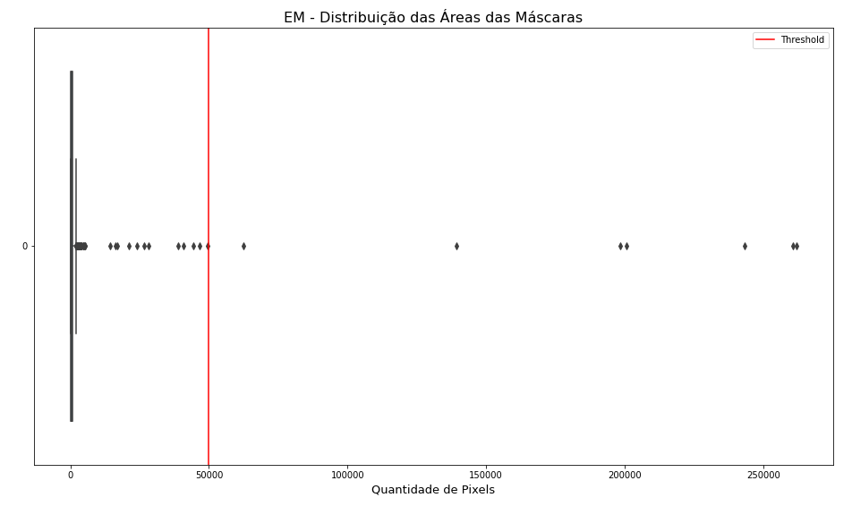
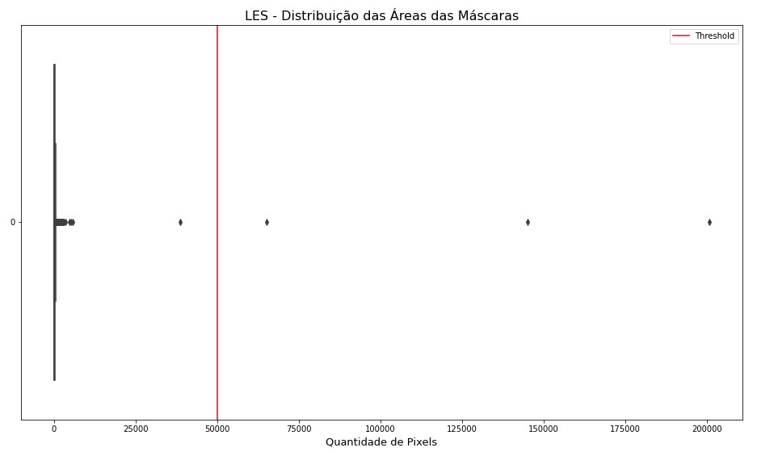

# Projeto Classificação por SVM de lesões de substância branca causadas por LES
# Project SVM classification of white matter lesions caused by SLE

# Apresentação

O presente projeto foi originado no contexto das atividades da disciplina de pós-graduação [*Ciência e Visualização de Dados em Saúde*](https://ds4h.org), oferecida no primeiro semestre de 2022, na Unicamp.

| Nome                       | RA     | Especialização |
| -------------------------- | ------ | -------------- |
| Cristiano Sampaio Pinheiro | 256352 | Computação     |
| Jhonatan Cléto             | 256444 | Computação     |
| Mylena Roberta dos Santos  | 222687 | Computação     |

# Introdução

Este projeto objetiva-se responder à seguinte pergunta de pesquisa da Dra. Simone Appenzeller, Professora Associada de Reumatologia da Faculdade de Ciências Médicas (FCM) da Unicamp:

> Qual é a etiologia mais provável das lesões de substância branca presentes em pacientes com Lúpus Eritematoso Sistêmico (LES)?

A fim de tentarmos encontrar uma resposta satisfatória, treinamos um classificador SVM (*Support Vector Machine*) para diferenciar lesões isquêmicas e desmielinizantes e, por conseguinte, predizer a etiologia mais provável das lesões de substância branca presentes nos indivíduos com LES.

O treinamento mencionado foi realizado com imagens de ressonância do cérebro de pacientes que sofreram Acidente Vascular Cerebral (AVC) ou têm Esclerose Múltipla (EM). Sendo que AVC e EM são capazes de causar, respectivamente, lesões de substância branca denominadas isquêmicas e desmielinizantes.

## Ferramentas

> Listagem das ferramentas utilizadas (na forma de itens).

## Preparo e uso dos dados

Para a construção do modelo de classificação, nos foram disponibilizados três conjuntos de imagens, sendo eles:

* AVC: conjunto com 1475 imagens de cortes de ressonância magnética do cérebro de pacientes que tiveram AVC;
* EM: conjunto com 2344 imagens de cortes de ressonância magnética do cérebro de pacientes que têm Esclerose Múltipla;
* LES: conjunto de 697 imagens de cortes de ressonância magnética do cérebro de pacientes que têm Lúpus Eritematoso Sistêmico.

Nesses conjuntos de imagens, existem ainda imagens auxiliares a alguns dos cortes, que delimitam as regiões do cérebro onde as lesões se encontram, utilizando a técnica de máscara binária     [1], sendo 581 máscaras para o conjunto AVC, 630 para o conjunto EM e 697 para o conjunto LES.

Durante a fase de preparação dos conjuntos de dados, adotamos o *pipeline* ilustrado na Figura 1. Vale ressaltar que cada etapa presente no *pipeline* foi realizada em um *notebook* independente.

_**Figura 1:** Pipeline aplicado para a classificação das imagens._

* **Seleção de imagens:** durante nossa análise inicial do conjunto de dados, notamos que algumas imagens não possuíam máscaras auxiliares ou as máscaras apresentavam delimitações claramente incorretas das lesões. Com isso, optamos por aplicar alguns critérios de seleção para definir os conjuntos de imagens que julgamos mais adequados para usar em nosso modelo.

* **Extração de atributos:** após a seleção de imagens, aplicamos algumas técnicas de extração de *features* das imagens, de modo a construir *datasets*, com informações que julgamos importantes para a fase de classificação das imagens dos conjuntos.

Na etapa de pré-processamento das imagens, há uma infinidade de outras técnicas que poderiam ser utilizadas, como normalização, transformações nas intensidades dos pixels e seleção de diversas outras *features* que poderiam ser utilizadas para o treinamento de um classificador. Em nosso *pipeline*, no entanto, optamos por não aplicar nenhuma dessas técnicas, uma vez que, a partir das atividades auxiliares a esse projeto, percebemos que elas não agregariam significância equivalente ao custo de sua aplicação nos conjuntos de imagens fornecidos.

Especificamente sobre a normalização em imagens de ressonância magnética, sua má aplicação pode levar a uma perda de acurácia nos resultados obtidos, enquanto que, quando utilizada de maneira correta os ganhos são mínimos [2]. Portanto, considerando a inexperiência da equipe com o domínio explorado, optamos por não usar nenhuma técnica de normalização nesse projeto. 

### Seleção de imagens

Em nossa abordagem de pré-processamento, optamos por utilizar apenas as imagens do conjunto fornecido para treinamento que possuíam máscaras delimitando as regiões do cérebro com lesões. Escolhemos proceder dessa maneira, pois acreditamos que obteremos melhores resultados no preditor utilizando um recorte nas regiões de lesões, do que utilizando a imagem completa do cérebro.

Durante o processo de seleção das máscaras, observamos que algumas delas estavam extremamente imprecisas, chegando, em alguns casos, a ocupar mais de 50% da imagem. Essas máscaras aparentam destoar bastante em relação ao tamanho das lesões nas imagens originais. Na Figura 2 apresentamos uma máscara “negativa”, onde a região da lesão é a única não demarcada, em preto.

  
_**Figura 2:** Exemplo de imagem descartada durante o processo de seleção._

Indo mais a fundo nessa questão, investigamos a distribuição dos pixels para todas as máscaras contidas nos conjuntos de imagens fornecido. Essas investigações, bem como o processo de seleção de imagens, estão codificados no *notebook* [image_selection.ipynb](notebooks/image_selection.ipynb).

As Figuras 3, 4 e 5, apresentam os *boxplots* das distribuições de pixels nos conjuntos AVC, EM e LES, respectivamente. Dos resultados obtidos, notamos a existência de muitos *outliers* localizados em valores superiores ao máximo da distribuição em todos os conjuntos.

Assim, consideramos que remover da seleção de imagens, as máscaras que apresentassem mais de 50000 pixels seria um limiar razoável, já que ele está por volta de 25% do tamanho da maioria das imagens.

 
_**Figura 3:** Boxplot da distribuição de pixels das máscaras do conjunto AVC._

  
_**Figura 4:** Boxplot da distribuição de pixels das máscaras do conjunto EM._

_**Figura 5:** Boxplot da distribuição de pixels das máscaras do conjunto LES._  

Aplicando os critérios de seleção de imagens citados anteriormente, reduzimos nosso conjunto de imagens aos seguintes valores: 

* AVC: 548 imagens selecionadas, cerca de 37.6% do conjunto original;
* EM: 623 imagens selecionadas, cerca de 26.6% do conjunto original;
* LES: 694 imagens selecionadas, cerca de 99.6% do conjunto original;

Desses resultados, notamos que perdemos uma fração significativa do número de imagens que nos foram fornecidas para treino - conjuntos AVC e EM -. Desse fato, concluímos que, embora o nosso processo de seleção de imagens fornece conjuntos mais robustos para treino, ele enfraquece a capacidade de aprendizado do modelo por reduzir drasticamente o conjunto de treino, diminuindo a robustez do classificador.

Partindo dos conjuntos de imagens selecionados, utilizando as máscaras foi possível determinar as coordenadas limites das lesões verificando os pixels com cores diferentes de preto. Com essas coordenadas, após a aplicação das máscaras, usando uma simples multiplicação de matrizes, foi possível cortar as imagens de ressonância que apresentavam lesões, obtendo assim somente a região de interesse (ROI) para a extração de *features*.

  
_**Figura 6:** Aplicação da máscara em uma lesão de EM._
 
### Extração de atributos

Ainda que a quantidade de pixels pretos nas imagens tenha diminuído após a aplicação das máscaras nas imagens, executamos os métodos de extração de *features* de maneira a não considerar esses pixels. Esse procedimento foi adotado visando a aplicação de descritores de textura, e, uma vez que as lesões estão concentradas próximas à cor branca, a princípio, acreditamos que os pixels pretos não agregarão na identificação e classificação dessas lesões. Ainda, no caso de múltiplas lesões com um grande espaçamento, o *background* pode corresponder a uma área muito maior que as lesões, o que pode gerar ruído nos dados obtidos, como podemos observar na Figura 7.

  
_Figura 7: Lesões de LES com grande espaçamento entre si._

Nessa etapa foram extraídos atributos provenientes do histograma e da textura das imagens, sendo que para essa última fizemos uso da Matriz de Coocorrência (GLCM), Matriz de Comprimento de Corrida (GLRLM) e Local Binary Pattern (LBP). Para todos esses descritores aplicamos modificações para desconsiderar os pixels pretos, sendo que todo o processo de extração dos atributos está detalhado no *notebook* [image_processing.ipynb](notebooks/image_processing.ipynb). 

Ainda, visando um descritor de forma, adicionamos uma *feature* correspondente a área da lesão  - isto é, a quantidade de pixels brancos -, extraída na etapa de seleção das imagens. Por fim, vale destacar que em alguns casos a GLCM pode variar de acordo com o ângulo, no entanto, nesse projeto esse fenômeno não deve ocorrer, assim, optamos por obter esse atributo de maneira cumulativa, utilizando de todos os ângulos possíveis.

Ao final do processo foram gerados três conjuntos de dados de *features*:  um destinado a lesões isquêmicas, outro para desmielinizantes e um último contendo as lesões de pacientes com LES. Além de trazer os atributos já mencionados, esses *datasets* também têm o identificador do paciente e, para as lesões isquêmicas e desmielinizantes, um rótulo indicando a doença causadora, utilizado para o treinamento do classificador. Todos os atributos extraídos e as suas respectivas descrições encontram-se na Tabela 1.

|Atributo|Descrição|
|---|---|
|patient| Identificador do paciente que originou a imagem|
|min| Menor valor encontrado no histograma|
|max| Maior valor encontrado no histograma|
|mean| Média aritmética dos valores presentes no histograma|
|variance| Variância dos valores encontrados no histograma|
|skewness| Assimetria ou obliquidade do histograma|
|kurtosis| Curtose, medida da forma que caracteriza a cauda do histograma|
|contrast_sum| Soma do contraste, diferença entre os tons de cinza|
|correlation_sum| Soma da correlação, dependência linear dos tons de cinza|
|energy_sum| Soma da energia, uniformidade da textura|
|homogeneity_sum| Soma da homogeneidade, medida da variação da textura|
|sre| Short Run Emphasis, ênfase em corrida curta|
|lre| Long Run Emphasis, ênfase em corrida longa|
|glu| Grey Level Uniformity, uniformidade de tom de cinza|
|rlu| Run Length Uniformity, uniformidade de tamanho de corrida|
|rpc| Run Percentage, percentagem de corrida, mede predominância dos tamanhos de corrida|
|min_LBP| Menor valor encontrado no histograma da LBP|
|max_LBP| Maior valor encontrado no histograma da LBP|
|mean_LBP| Média aritmética dos valores presentes no histograma da LBP|
|variance_LBP| Variância dos valores encontrado no histograma da LBP|
|skewness_LBP| Assimetria ou obliquidade do histograma da LBP|
|kurtosis_LBP| Curtose, medida da forma que caracteriza a cauda do histograma da LBP|
|area| Número de pixels com valor maior que zero presentes nas imagem|
|target| Grupo ao qual o paciente pertence (AVC ou EM)|

_**Tabela 1:** Atributos extraídos do conjunto de imagens._

# Metodologia

Como mencionado anteriormente, optamos por utilizar um classificador SVM (*Support Vector Machine*) [3][4] de modo a buscar a resposta para pergunta de pesquisa levantada. O código empregado para todo o desenvolvimento do classificador está no *notebook* [svm_classification.ipynb](notebooks/svm_classification.ipynb).

Em relação ao treinamento do modelo, os dados empregados resultaram da concatenação dos *datasets* de atributos extraídos das imagens de ressonância magnética de pacientes com lesões de substância branca isquêmicas ([avc_features.csv](data/processed/avc_features.csv)) e desmielinizantes ([em_features.csv](data/processed/em_features.csv)).

Em relação a predição, por sua vez, os dados oferecidos ao classificador resultaram do *dataset* de atributos extraídos das imagens de ressonância magnética de pacientes com LES ([les_features.csv](data/processed/les_features.csv)).

É válido ressaltar ainda que, para ambos os conjuntos de treinamento e predição, foi necessário aplicar um pequeno processo de preparação para o uso. Citando os pontos essenciais, foi preciso separar os atributos dos conjuntos em variáveis adequadas para o uso no classificador e também uniformizar os valores das *features* para que o preditor funcionasse adequadamente [5].

Para escolher os hiperparâmetros que definem o modelo, utilizamos de um estimador (GridSearchCV) que realiza uma pesquisa exaustiva sobre valores de parâmetros especificados a ele [6][7][8]. Optamos pelo uso de uma gama ampla de parâmetros, dada a falta de profundidade no conhecimento que temos sobre o domínio do problema e a pouca experiência em desenvolvimento de algoritmos de classificadores.

Ademais, junto ao estimador de hiperparâmetros mencionado, empregamos uma variante do iterador KFold para realizar a validação cruzada dos dados de treinamento do modelo [9]. Essa variante (GroupKFold), de acordo com a documentação, garante que um mesmo grupo não esteja nos conjuntos de teste e treinamento [10][11]. Isto é, no caso do nosso modelo, garante que os cortes associados a um mesmo paciente não estão em ambos os conjuntos de teste e treinamento.

A Tabela 2 apresenta os resultados mais relevantes do treinamento do modelo.

| Rótulo | Resultado |
| -- | -- |
| param_C | 1 |
| param_degree| 1 |
| param_gamma | 0.1 |
| param_kernel | rbf |
| mean_test_score | 0.943324 |
| std_test_score | 0.030098 |
| mean_train_score | 0.961087 |
| std_train_score | 0.00256 |

_T**abela 2:** Principais resultados do treinamento do classificador SVM._

Ao fim, geramos um arquivo CSV ([les_classification.csv](data/processed/les_classification.csv)) que o associa cada predição de etiologia da lesão por LES ao seu respectivo paciente. Esse arquivo serviu como base para analisarmos e tentarmos compreender os resultados obtidos pelo classificador SVM.

# Resultados Obtidos e Discussão

> Esta seção deve apresentar o resultado de predição das lesões de LES usando o classificador treinado. Também deve tentar explicar quais os atributos relevantes usados na classificação obtida
> * apresente os resultados de forma quantitativa e qualitativa
> * tenha em mente que quem irá ler o relatório é uma equipe multidisciplinar. Descreva questões técnicas, mas também a intuição por trás delas.

# Conclusão

> Destacar as principais conclusões obtidas no desenvolvimento do projeto.
>
> Destacar os principais desafios enfrentados.
>
> Principais lições aprendidas.
>
> Trabalhos Futuros:
> * o que poderia ser melhorado se houvesse mais tempo?

# Referências Bibliográficas

> Lista de artigos, links e referências bibliográficas (se houver).
>
> Fiquem à vontade para escolher o padrão de referenciamento preferido pelo grupo.
